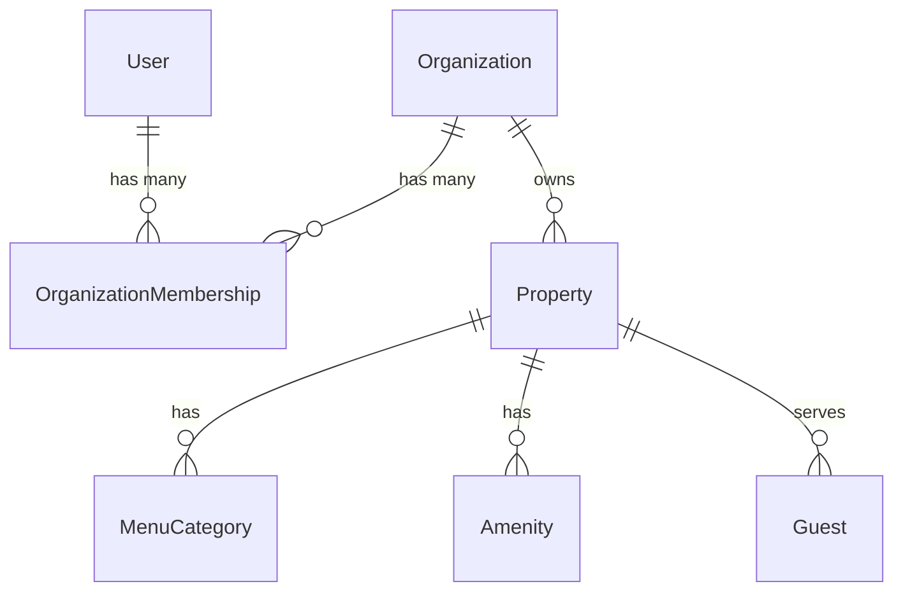

# ScanVista Platform Architecture

## Core Philosophy
ScanVista has transitioned from a single-tenant property management system into a full multi-tenant **Operating Companion** platform. This architecture ensures strict data isolation, role-based access control, and a scalable foundation for hospitality businesses ranging from single boutique hotels to massive global enterprise chains.

## The Tenant Hierarchy
The core hierarchy of the system relies on three interconnected entities:
1. **User**: Represents a human (manager, staff, owner) authenticating into the system via OAuth. Users *do not* inherently own data.
2. **Organization**: Represents the business entity (e.g., "ScanVista Hotels Inc."). Organizations hold the subscription, billing, and macro-level settings.
3. **Property**: Represents a physical location (e.g., "ScanVista Resort Miami"). Properties belong to an Organization and hold all hospitality-specific data (menus, QR codes, guests).

### Relational Model

## Security & Authorization Middleware
The platform relies on a strict, three-layer middleware stack to guarantee tenant isolation. Every protected API route must pass through these layers sequentially:

### 1. `requireAuth`
- Validates the session.
- Ensures the user is logged in.
- Injects `req.userContext = { userId }`.

### 2. `requireOrgAccess`
- Looks up the user's highest `OrganizationMembership`.
- Ensures the user actually belongs to an Organization.
- Expands the context: `req.userContext = { userId, orgId, orgRole }`.

### 3. `requirePropertyAccess`
- Extracts the `slug` or `id` from the request parameters or body.
- If present, verifies that the requested Property belongs to the user's `orgId`.
- Prevents cross-tenant access attacks (e.g., User A attempting to modify Property B by guessing its slug).

## Future-Proofing
By divorcing `User` from `Property` directly and routing ownership through `OrganizationMembership`, the system inherently supports:
- Consultants managing multiple hotel groups simultaneously.
- Enterprise clients with unified billing and isolated property performance metrics.
- Seamless staff onboarding/offboarding at the organizational level without touching individual property records.
